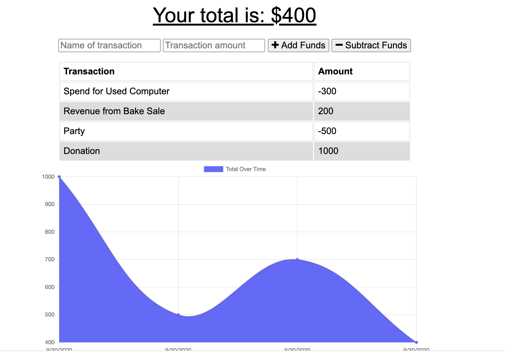

 ## Budget Tracker

### Introduction
Github Repository
``` text 
https://github.com/anitapeppercorn/Budget-Tracker
```
App is Deployed at:
``` text
https://serene-chamber-87874.herokuapp.com/
```

Giving users a fast and easy way to track their money is important, but allowing them to access that information at any time is even more important. Having offline functionality is paramount to the success of an application that handles users’ financial information.


## Contents
- [Description](#Description)
- [App Screenshot](#App)
- [User Story](#User-Story)
- [Acceptance Criteria](#Acceptance-Criteria)
- [Concepts](#Concepts)
- [License](#License)
- [Author](#Author)

## Description

I have updated an existing budget tracker application to allow for offline access and functionality. The user will be able to add expenses and deposits to their budget with or without a connection. If the user enters transactions offline, the total should be updated when they're brought back online. The application is deployed to Heroku.

### App Screenshot



## User Story
AS AN avid traveler
I WANT to be able to track my withdrawals and deposits with or without a data/internet connection
SO THAT my account balance is accurate when I am traveling

## Acceptance Criteria
GIVEN a budget tracker without an internet connection
WHEN the user inputs an expense or deposit
THEN they will receive a notification that they have added an expense or deposit
WHEN the user reestablishes an internet connection
THEN the deposits or expenses added while they were offline are added to their transaction history and their totals are updated


## Concepts

I used IndexedDB to add offline Persistence. I added a service worker to application to make it a Progressive Web Applications (PWA), We provide the functionality:
1. To enter deposits offline.
2. To enter expenses offline.
3. Offline entries are added to the tracker when the application is brought back online.
4. This is mobile-first application, I added a web manifest to application with the app’s metadata, to let users’ devices know what they’re installing and how the app should look on the home screen.

## License
[MIT License](./LICENSE)


## Author: Anita Ganti

View the authors' portfolio at:  
https://anitapeppercorn.github.io/anitaprofileportfolio/
 


[Table of Content](#Table-of-Content) --- [Back to Top](#Budget-Tracket-API) --- # Budget-Tracker-API

